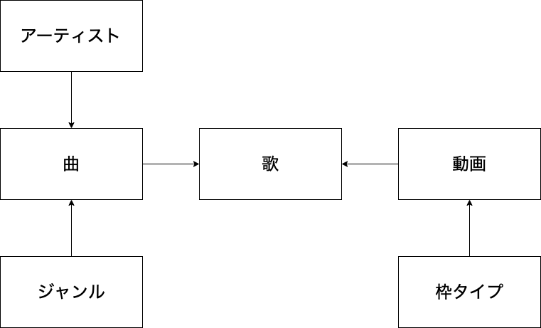

# 設計

## データ

フロントエンドだけで完結させるために DB は使っていない．  
代わりに `data/*.ts` 中に埋め込んでいる．  
データの持ち方は以下のように正規化していて，外部キーは添字を持つことで表現している．



## Component と State

- お気に入りや表示のための情報は複数のページで利用するため，`context` を用いたグローバルステートにしている（`lib/appStateContext.tsx`）
- 検索条件についての情報は各ページのトップのコンポーネントで持っている

## 共通のレイアウト（`components/Layout.tsx`）

`KeyVisual` は `'/'` ではピックアップのサムネ，それ以外ではデフォルメ画像を表示している．

```
MyApp
├ Header
├ Main
│ ├ KeyVisual
│ └ 各ページのコンポーネント
└ Footer
```
