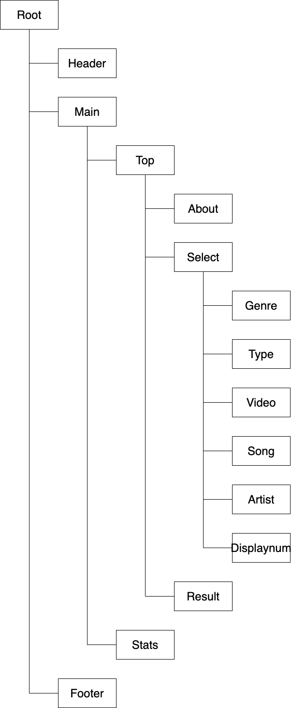

# 設計

## データ
フロントエンドだけで完結させるためにDBは使っていない．  
代わりに/src/data.ts中に埋め込んでいる．  
データの持ち方は以下のように正規化していて，外部キーは添字を持つことで表現している．

## Reactのcomponent, state

- TopとStatsの切り替えはHeaderから変えるので，page stateはRootで持つ
- Resultの表示はSelect以下のコンポーネントから変えるので状態はTopで持つ

